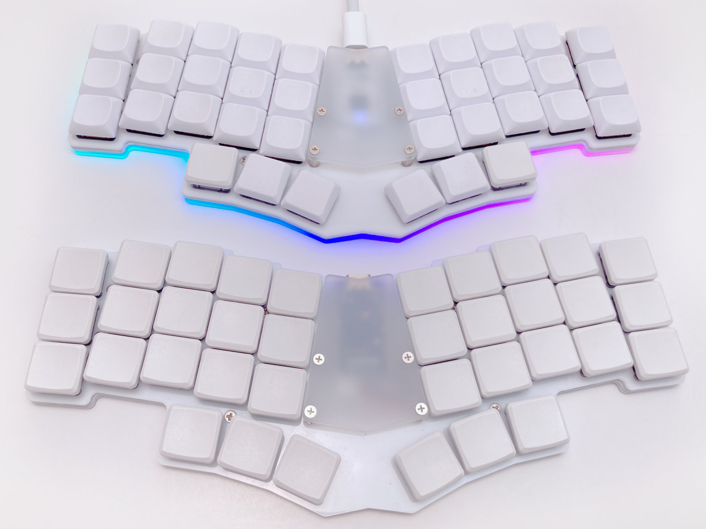
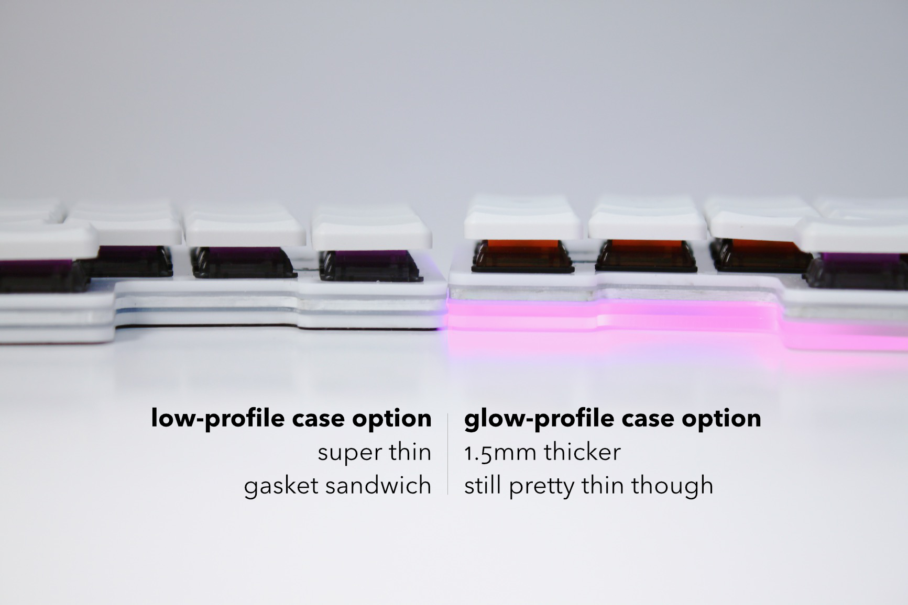
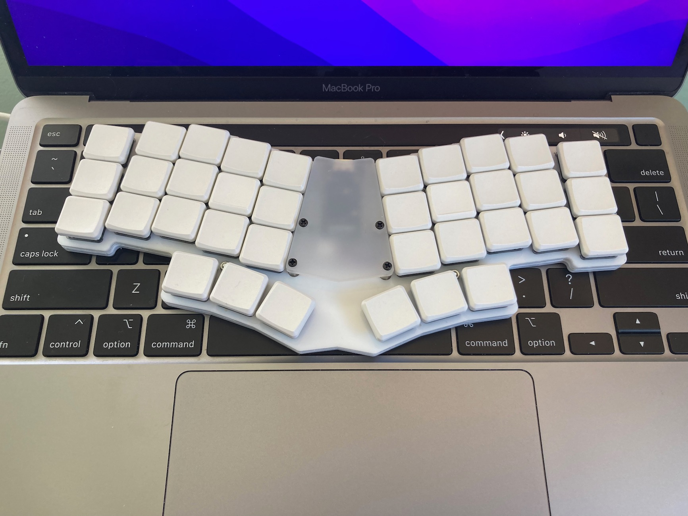
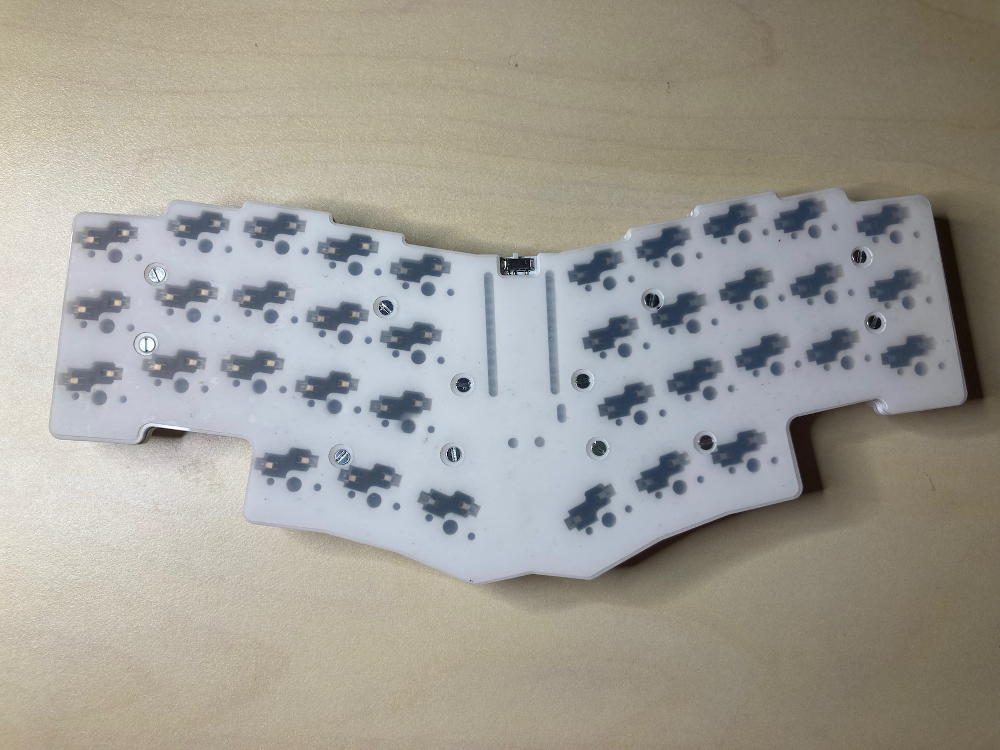
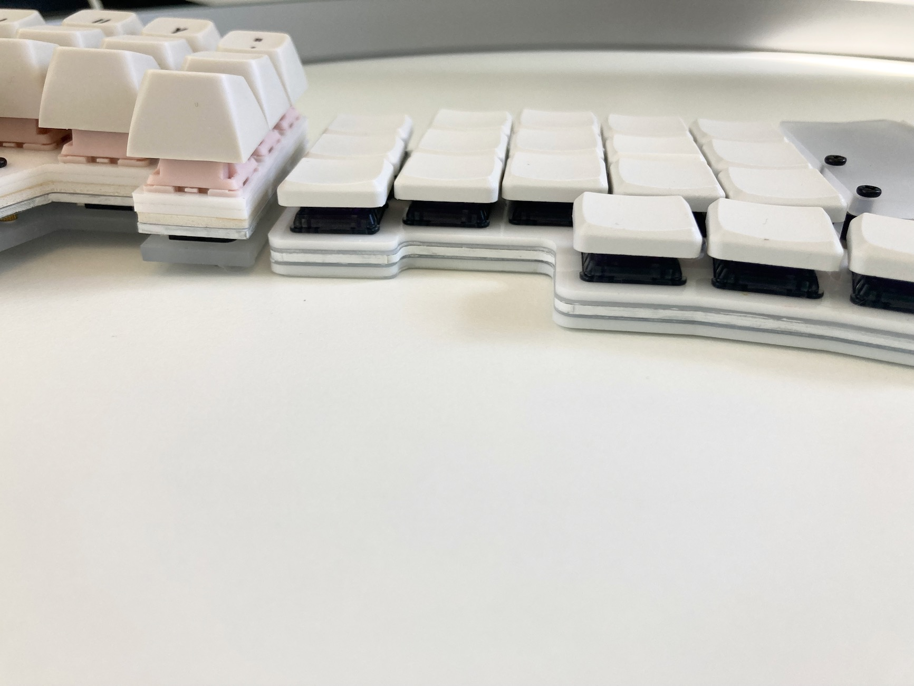

# Egret

A 36 key Choc-spaced monoblock keyboard that's wireless compatible, hot swappable, gasket mounted, and very thin. Inspired by the [chocV](https://github.com/brickbots/chocV) and [Horizon](https://github.com/skarrmann/horizon/).

The Egret's bottom plate has cutouts for the hotswap sockets, essentially the thinnest board possible with hotswap sockets. Silicone gaskets sandwiching both sides of the PCB dampen sounds and vibrations. The entire bottom is covered with rubber sheet so you can use it right on your laptop keys if you're so inclined!



## Features

* Choc hotswap sockets with Choc spacing
* Gasket mounted
* On/off slider switch and JST plug for battery power
* Totally flat bottom, so you can put it right on top of your laptop keyboard and Miyoku on the go
* Optional LED underglow for wired mode, if underglow is your thing. It's very much my thing
* Two bottom plate options: lowpro mode for the thinnest board physically possible, or glowpro mode for epic underglow at the expense of a couple mm of thickess.

## Wicked Thin and Flat

The bottom plate is cut out to accomodate the hotswap sockets, making it about as thin as is physically possible to make a hotswap board. The entire bottom is intended to be covered with rubber, sililicone, EVA, etc, so you can put it down on right over your laptop's keys. Yes this actually works and is useable! 









## Build Guide

There are two ways to build it, with LED underglow (glow-profile case) and without (low profile case). The LED version requires a different bottom plate which is 1.5mm taller than the low-profile version, but everything else is the same between them—same PCB, top plate, gaskets, etc. _Either_ version can be used with bluetooth! Obviously running the LEDs will drain your battery much faster, but it's easy to have  the best of both worlds by configuring ZMK to automatically enable LEDs when plugged into USB and disable them when on battery power.

* Build guide for [low profile version](./docs/rev1/build_guide_lowpro_rev1.md) (no LEDs)
* Build guide for [glow profile version](./docs/rev1/build_guide_glowpro_rev1.md) (with LED underglow)

## Firmware

### QMK

Egret is not in the main QMK repo yet (or probably ever) but it's easy to add to your local.
Assuming you already have QMK set up on your computer, copy the contents of `./firmware/qmk` to `qmk_firmware/keyboards/egret`. There is a very minimal basic keymap for you to start with.

```sh
cp -R ./firmware/qmk /path/to/qmk_firmware/keyboards/egret
cd !$
cp -R keymaps/default keymaps/your-github-username
```

### ZMK

Egret is not in the main ZMK repo but it's easy to add. Assuming you already have a zmk-config setp already, copy the contents of `./firmware/zmk` to `zmk-config/config/boards/shields/egret`, then make the usual setup. There is a basic minimal keymap for you to start with.

```sh
cp -R ./firmware/zmk /path/to/zmk-config/config/boards/shields/egret
cd /path/to/zmk-config/config
cp boards/shields/egret/egret.keymap .
touch egret.conf
```

## Tweak Your Own With Ergogen

This board is generated with the amazing ergogen tool, then post-processed with KiCad and vector graphics drawing tools. I used several custom footrpints to pull off the "horizon construction" on the bottom plate. Since ergogen does not currently support adding footprints at runtime, I Dockerized it and copied my footprints into the image. The Dockerfile lives in `ergogen/container` and can be run with a little wrapper script I wrote in `ergogen/bin/ergogen`. 

To generate the board (which you should not need to unless you want to change something):

```shell
$ cd ergogen
$ bin/ergogen egret.yml
```

If you decide to edit a footprint, you'll need to remove the image and rebuild it.
```shell
# Only if you modify a footprint, rebuild the image like so:
$ docker image rm -f ergogen-egret && bin/ergogen egret.yml
```

